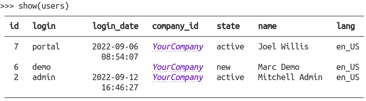

# Odoo Show 🔎️

Odoo Show is a python library that uses [`rich`](https://github.com/Textualize/rich) to
give you goggles when diving into the Odoo Shell.

Basic usage:

```python
from odooshow import show
partners = env["res.partner"].search([])  # Any recordset will do

show(partners)
```

This would be the output:



A quick demo with some common usage features:

[](https://asciinema.org/a/525597)


## Installation

You'll need `rich` and `odoo`.

To install with pip, simply:

```bash
pip install odooshow
```

## Known issues

- Better support for OdooRPC.

## Roadmap

- Make an Odoo module so we can plug the funcionality directly into the model abstract.
- Configurable column totals. Now we're getting them from the field info.


---
## Usage
* add `odooshow` library to your pip.txt
* run `invoke img-build; docker-compose down`
* then, run `docker-compose run --rm -l traefik.enable=false odoo shell` # for executing the odoo shell
* when inside the shell, run:
>>> from odooshow import show
 * then you can start tinkering with:
>>> show(self)

>>> show(env["res.partner"])

>>> show(env["res.partner"].search([]))

>>> show(env["res.partner"].search([], limit=1))

>>> show(env["res.partner"].search([], limit=10), groupby="parent_id")

>>> show(env["sale.order"].search([]))

>>> show(env["sale.order"].search([]), show_footer=True)

>>> show(env["sale.order"].search([]), ["name", "amount_total"], show_footer=True)

>>> show(env["sale.order"].search([]).order_line, ["product_id", "product_uom_qyt", "price_unit", "price_subtotal"], show_footer=True)

>>> show(env["sale.order"].search([]).order_line, ["product_id", "product_uom_qyt", "price_unit", "price_subtotal"], show_footer=True, groupby="order_id")

>>> show(env["sale.order"].search([]).order_line, ["product_id", "product_uom_qyt", "price_unit", "price_subtotal"], show_footer=True, groupby="order_id", partials=True)


---
### Missing:
* different options, and what they do.
* many other things...
- ñlkjh
* diffrent options, and what they do.
- other things... (again ¿?)
